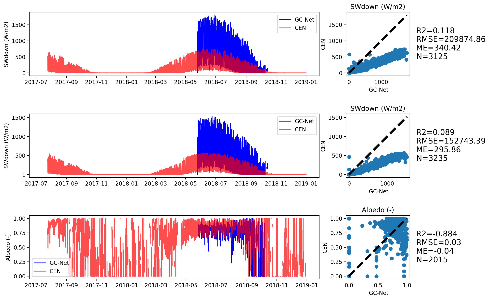
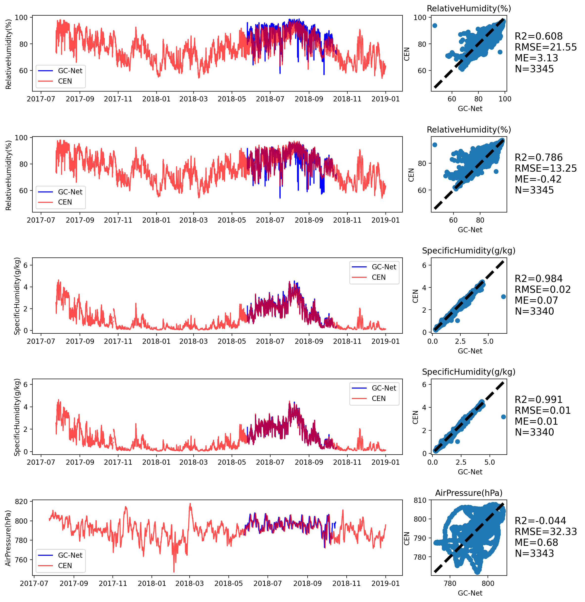
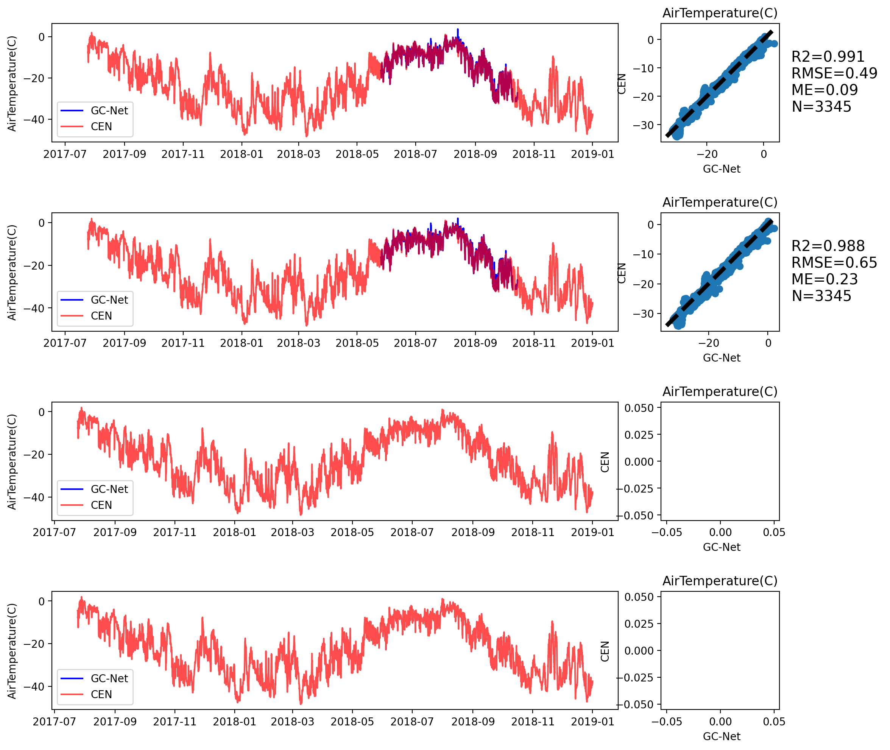
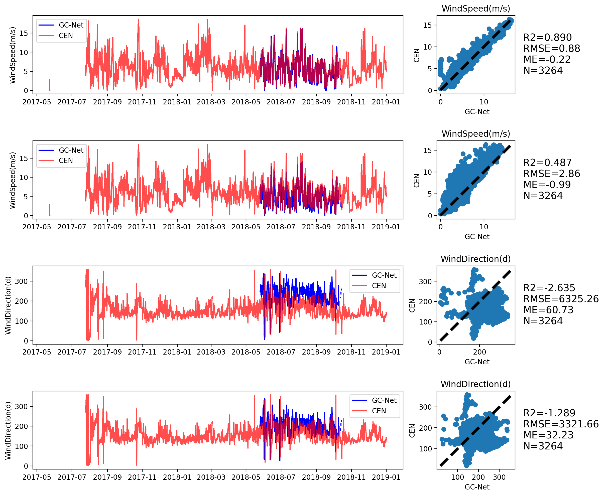
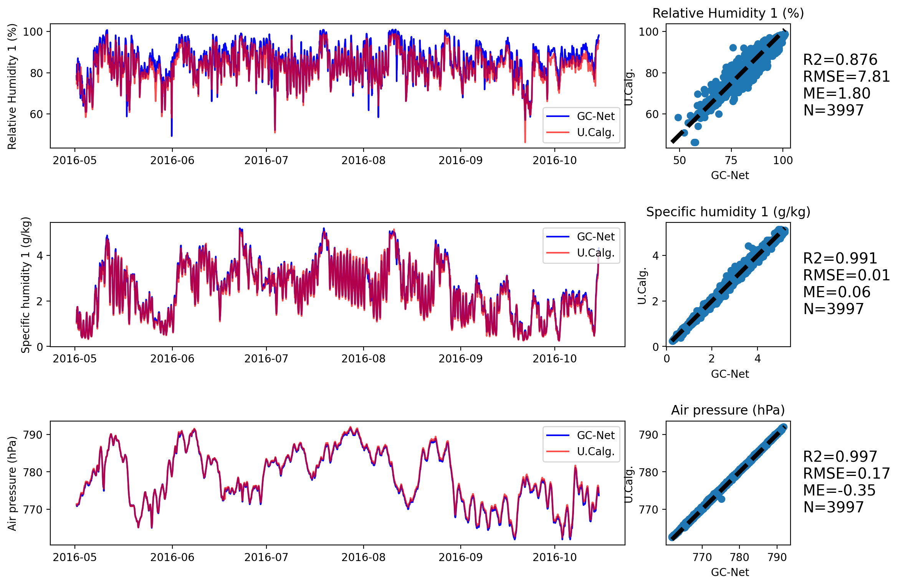
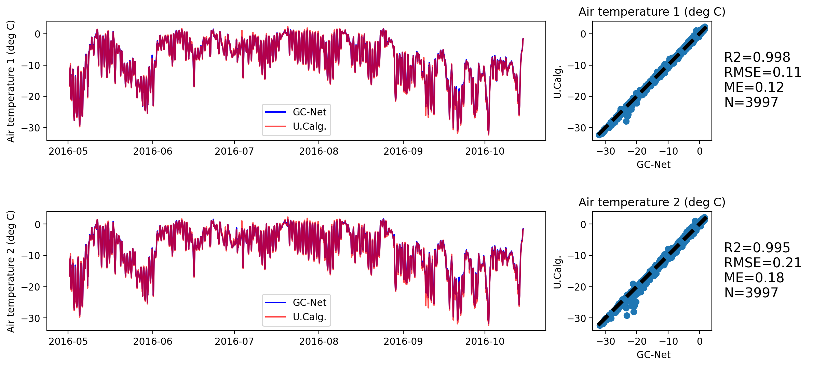
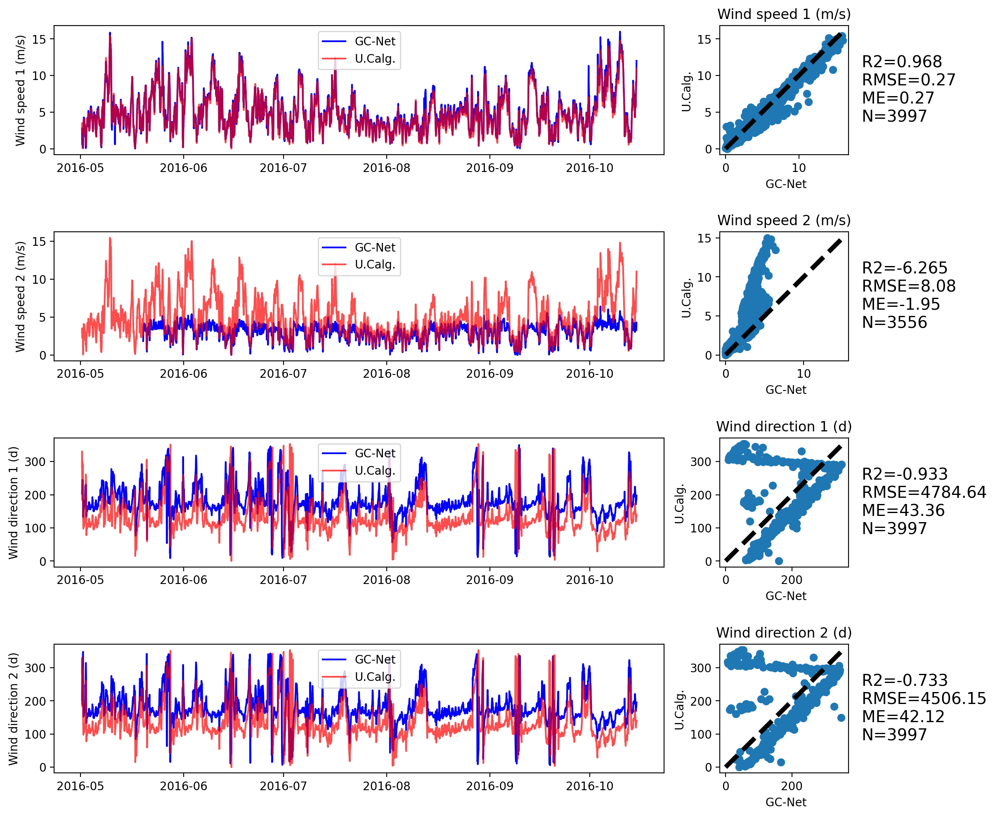

# GC-Net-evaluation

Evaluation of the Greenland Climate Network (GC-Net) Automatic Weather Station: 
Effect of sampling choices and impact of uncertainty on surface energy budget calculation

B.Vandecrux, N. Karlson, J. E. Box

 

# EastGRIP
## Air temperature

## Relative Humidity and Air Pressure

## Wind speed and direction

## Night/day dependant temperature bias
 (ME = GC-Net - PROMICE)

|metric|time |  TA1   |  TA2   |
|------|-----|-------:|-------:|
|RMSE  |all  |    0.35|    0.32|
|ME    |all  |    0.00|    0.15|
|R2    |all  |    0.99|    0.99|
|N     |all  |17415.00|17415.00|
|RMSE  |night|    0.23|    0.17|
|ME    |night|   -0.11|    0.06|
|R2    |night|    0.99|    0.99|
|N     |night| 2964.00| 2964.00|
|RMSE  |day  |    0.66|    0.57|
|ME    |day  |   -0.04|    0.11|
|R2    |day  |    0.98|    0.98|
|N     |day  | 3064.00| 3064.00|

# GITS-CEN

## Shortwave radiation

## Relative Humidity and Air Pressure

## Air temperature

## Wind speed and direction

## Night/day dependant temperature bias
 (ME = GC-Net - PROMICE)

|metric|time |  TA1  |  TA2  |
|------|-----|------:|------:|
|RMSE  |all  |   0.48|   0.64|
|ME    |all  |   0.09|   0.22|
|R2    |all  |   0.99|   0.98|
|N     |all  |3345.00|3345.00|
|RMSE  |night|   6.83|   8.30|
|ME    |night|   1.67|   1.93|
|R2    |night|   0.08|  -0.21|
|N     |night|  11.00|  11.00|
|RMSE  |day  |   0.48|   0.47|
|ME    |day  |  -0.06|   0.01|
|R2    |day  |   0.96|   0.96|
|N     |day  |1138.00|1138.00|

# Dye-2
## Shortwave radiation

## Relative Humidity and Air Pressure

## Air temperature

## Wind speed and direction

## Night/day dependant temperature bias
 (ME = GC-Net - UCalg)

|metric|time |  TA1  |  TA2  |
|------|-----|------:|------:|
|RMSE  |all  |   0.10|   0.21|
|ME    |all  |   0.12|   0.17|
|R2    |all  |   0.99|   0.99|
|N     |all  |3997.00|3997.00|
|RMSE  |night|   0.13|   0.24|
|ME    |night|   0.30|   0.40|
|R2    |night|   0.99|   0.98|
|N     |night|  24.00|  24.00|
|RMSE  |day  |   0.07|   0.09|
|ME    |day  |  -0.02|  -0.06|
|R2    |day  |   0.99|   0.99|
|N     |day  |1393.00|1393.00|

# Summit
on the way...

