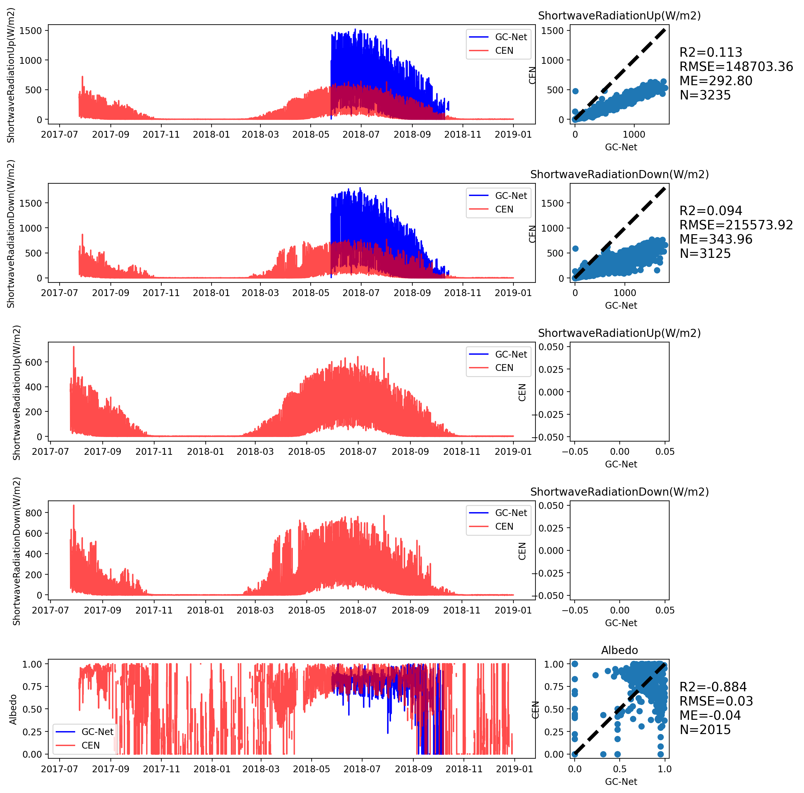

# GC-Net-evaluation

Evaluation of the Greenland Climate Network (GC-Net) Automatic Weather Station: 
Effect of sampling choices and impact of uncertainty on surface energy budget calculation

B.Vandecrux, N. Karlson, J. E. Box

 

# Dye-2
## Shortwave radiation

## Relative Humidity and Air Pressure

## Air temperature

## Wind speed and direction

# EastGRIP
## Shortwave radiation

## Relative Humidity and Air Pressure

## Air temperature

## Wind speed and direction

