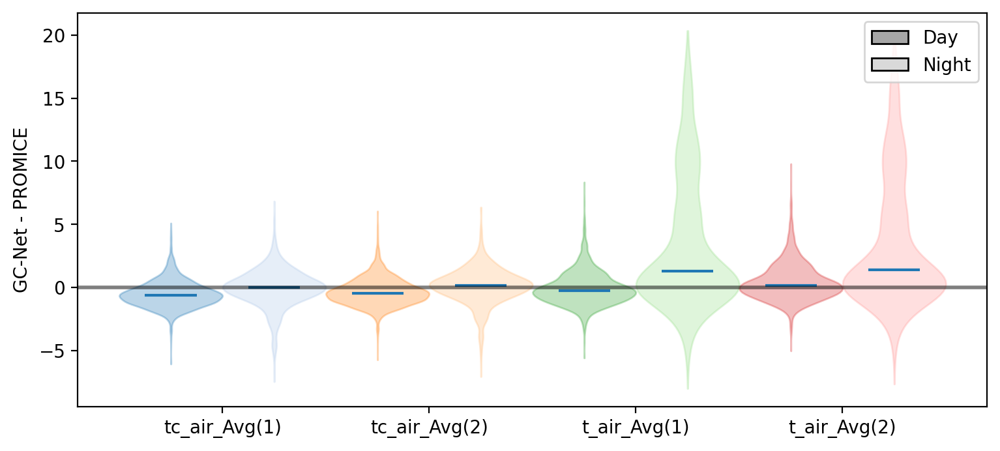
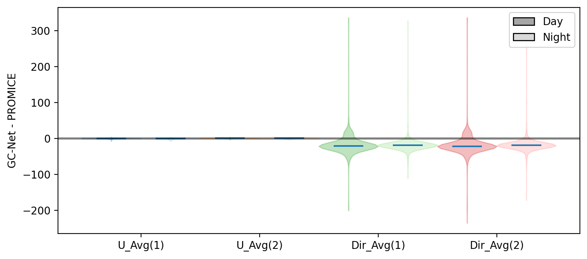
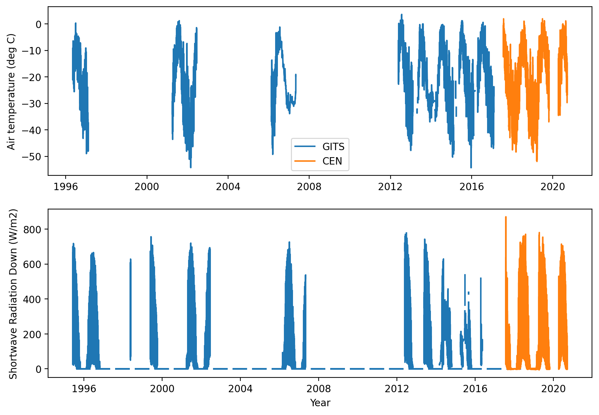

# GC-Net-evaluation

Evaluation of the Greenland Climate Network (GC-Net) Automatic Weather Station: 
Effect of sampling choices and impact of uncertainty on surface energy budget calculation

B.Vandecrux, N. Karlson, J. E. Box

 

# EastGRIP
## Air temperature

## Relative Humidity and Air Pressure

## Wind speed and direction

## Statistics
|metric|time |  TA1   |  TA2   |  RH1   |  RH2   |SpecHum1|SpecHum2|   P    |  VW1   |  VW2   |  DW1   |  DW2   |
|------|-----|-------:|-------:|-------:|-------:|-------:|-------:|-------:|-------:|-------:|-------:|-------:|
|RMSE  |all  |    0.35|    0.32|  388.35|  299.69|    0.01|    0.01|    1.60|    1.91|    0.51| 1326.84| 1232.55|
|ME    |all  |    0.00|    0.15|   17.14|   14.36|   -0.05|   -0.06|    0.03|   -0.55|    0.00|  -16.61|  -17.15|
|R2    |all  |    0.99|    0.99|   -6.00|   -2.95|    0.97|    0.97|    0.98|    0.64|    0.90|    0.39|    0.46|
|N     |all  |17415.00|17415.00|17415.00|17415.00|17133.00|17133.00|17415.00|17415.00|17415.00|17280.00|17280.00|
|RMSE  |night|    0.23|    0.17|  551.32|  425.84|    0.00|    0.00|    2.79|    2.82|    0.78| 1499.51| 1466.16|
|ME    |night|   -0.11|    0.06|   23.02|   20.23|   -0.01|   -0.01|    0.42|   -0.78|   -0.05|  -15.43|  -14.61|
|R2    |night|    0.99|    0.99|   -6.90|   -3.40|    0.99|    0.99|    0.97|    0.54|    0.86|    0.34|    0.38|
|N     |night| 2964.00| 2964.00| 2964.00| 2964.00| 2834.00| 2834.00| 2964.00| 2964.00| 2964.00| 2924.00| 2924.00|
|RMSE  |day  |    0.66|    0.57|  161.10|  103.46|    0.03|    0.04|    1.58|    0.82|    0.16| 1517.51| 1383.79|
|ME    |day  |   -0.04|    0.11|    7.35|    3.29|   -0.12|   -0.16|   -0.46|   -0.30|    0.04|  -15.86|  -17.12|
|R2    |day  |    0.98|    0.98|   -2.35|   -0.95|    0.93|    0.90|    0.96|    0.78|    0.95|    0.42|    0.50|
|N     |day  | 3064.00| 3064.00| 3064.00| 3064.00| 3064.00| 3064.00| 3064.00| 3064.00| 3064.00| 3061.00| 3061.00|

## Violin plots

# GITS-CEN

There is currently no overlap between the two dataset.
Need to ask for more recent GITS data (transmission?).

# Dye-2
## Shortwave radiation

## Relative Humidity and Air Pressure

## Air temperature

## Wind speed and direction

