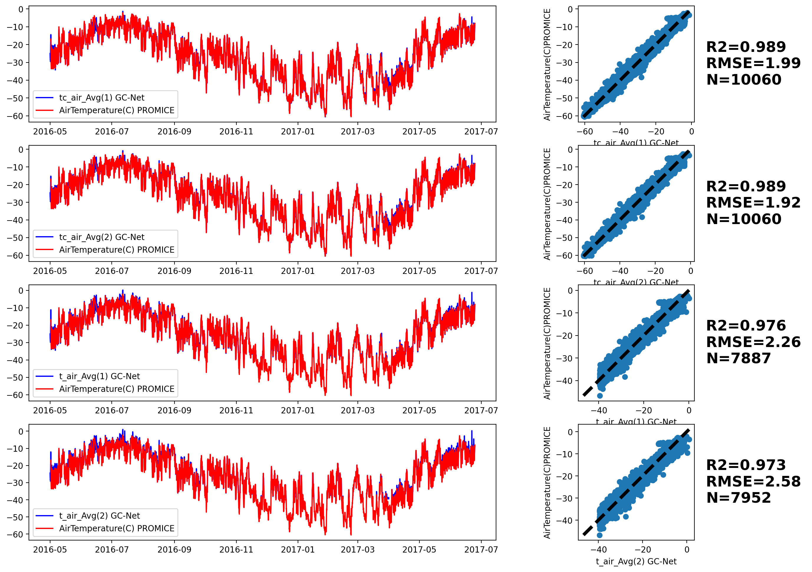
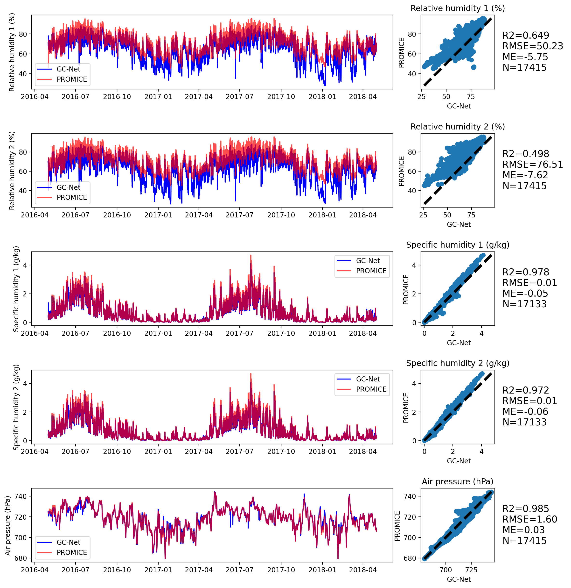
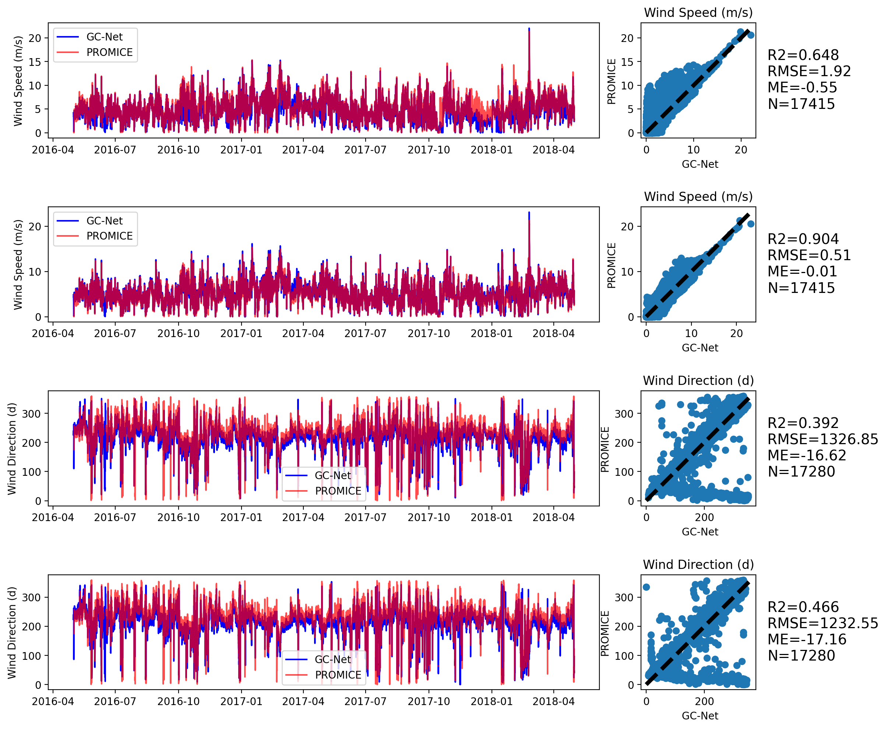
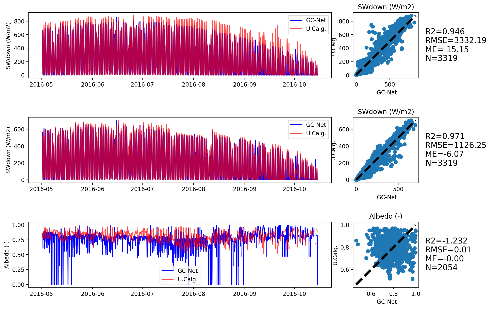
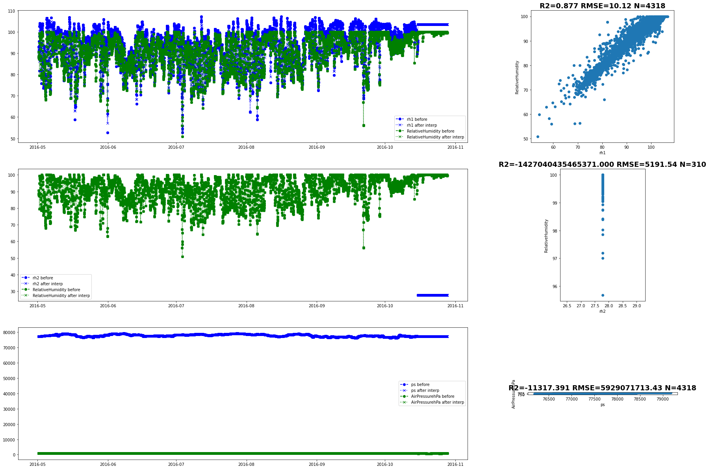
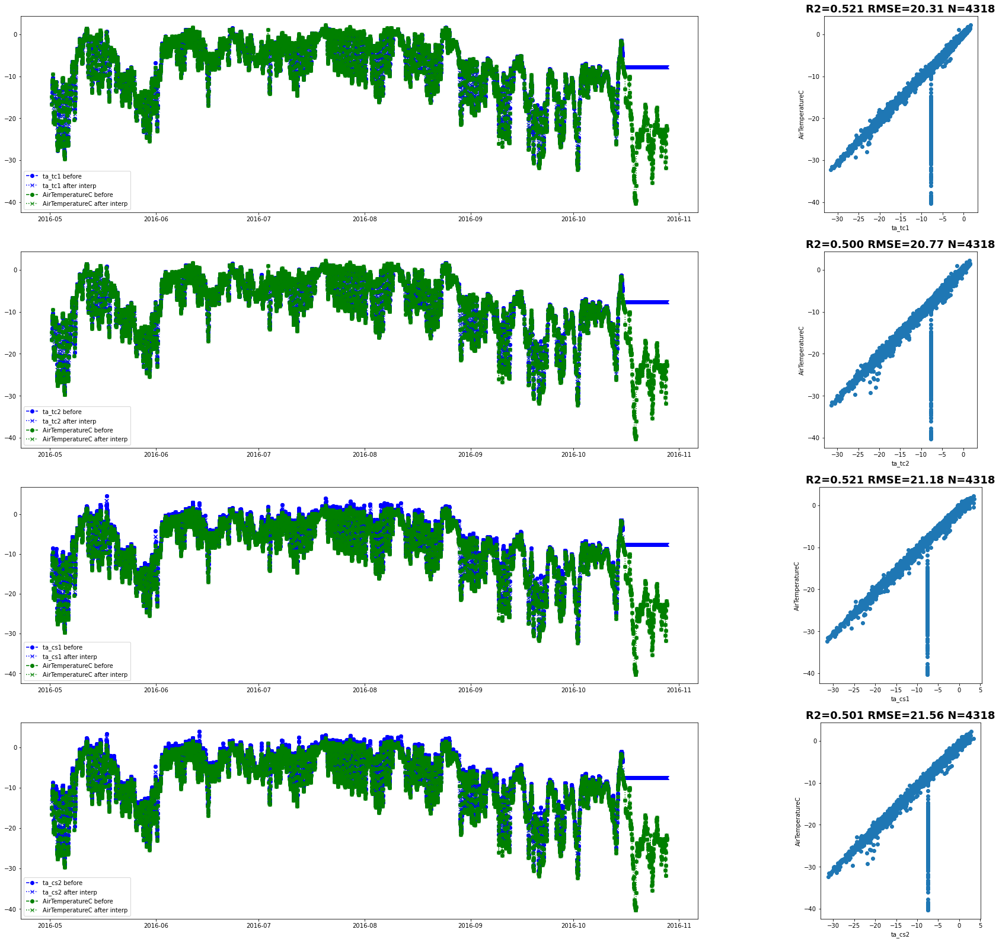
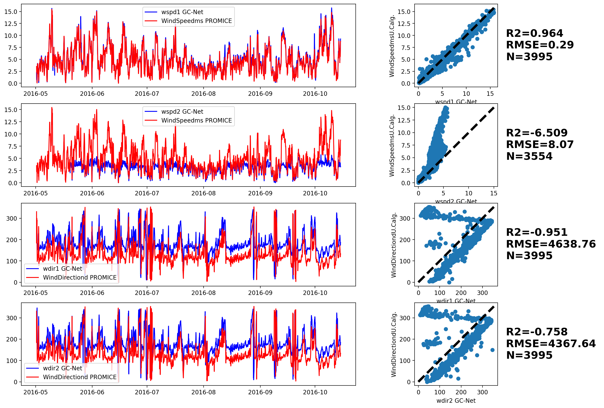

# GC-Net-evaluation

Evaluation of the Greenland Climate Network (GC-Net) Automatic Weather Station: 
Effect of sampling choices and impact of uncertainty on surface energy budget calculation

B.Vandecrux, N. Karlson, J. E. Box

 

# EastGRIP
## Air temperature

## Relative Humidity and Air Pressure

## Wind speed and direction

## Statistics
|metric|time |tc_air_Avg(1)|tc_air_Avg(2)|t_air_Avg(1)|t_air_Avg(2)|rh_Avg(1)|rh_Avg(2)|SpecificHumidity(g/kg)|pressure_Avg|U_Avg(1)|U_Avg(2)|Dir_Avg(1)|Dir_Avg(2)|
|------|-----|------------:|------------:|-----------:|-----------:|--------:|--------:|---------------------:|-----------:|-------:|-------:|---------:|---------:|
|RMSE  |all  |         1.99|         1.91|       16.63|       16.89|    35.26|    51.49|                  0.01|        4.62|    2.10|    0.97|   1397.31|   1337.06|
|ME    |all  |         0.00|         0.18|        1.54|        1.80|    -4.77|    -6.33|                  0.10|       -0.15|   -0.40|    0.04|    -17.08|    -17.76|
|R2    |all  |         0.98|         0.98|        0.87|        0.87|     0.67|     0.50|                  0.97|        0.96|    0.59|    0.81|      0.29|      0.35|
|N     |all  |     10060.00|     10060.00|    10060.00|    10060.00| 10060.00| 10060.00|              10060.00|    10060.00|10060.00|10060.00|  10060.00|  10060.00|
|RMSE  |night|         2.30|         2.08|       38.19|       38.03|    41.52|    50.64|                  0.00|        3.47|    3.01|    1.34|    947.46|    949.96|
|ME    |night|        -0.06|         0.10|        3.37|        3.46|    -5.98|    -6.73|                  0.05|        0.47|   -0.51|   -0.02|    -18.13|    -17.75|
|R2    |night|         0.97|         0.97|        0.00|        0.01|     0.59|     0.50|                  0.91|        0.96|    0.48|    0.77|      0.55|      0.54|
|N     |night|      1483.00|      1483.00|     1483.00|     1483.00|  1483.00|  1483.00|               1483.00|     1483.00| 1483.00| 1483.00|   1483.00|   1483.00|
|RMSE  |day  |         1.41|         1.29|        1.77|        2.33|    33.41|    60.18|                  0.02|       10.42|    1.20|    0.62|   1858.82|   1799.55|
|ME    |day  |        -0.52|        -0.34|       -0.07|        0.42|    -2.84|    -5.96|                  0.15|       -0.74|   -0.25|    0.08|    -15.97|    -17.42|
|R2    |day  |         0.97|         0.97|        0.96|        0.95|     0.03|    -0.42|                  0.96|        0.77|    0.69|    0.84|      0.17|      0.25|
|N     |day  |      2217.00|      2217.00|     2217.00|     2217.00|  2217.00|  2217.00|               2217.00|     2217.00| 2217.00| 2217.00|   2217.00|   2217.00|

##Violin plots

# GITS-CEN

There is currently no overlap between the two dataset.
Need to ask for more recent GITS data (transmission?).

# Dye-2
## Shortwave radiation

## Relative Humidity and Air Pressure

## Air temperature

## Wind speed and direction

