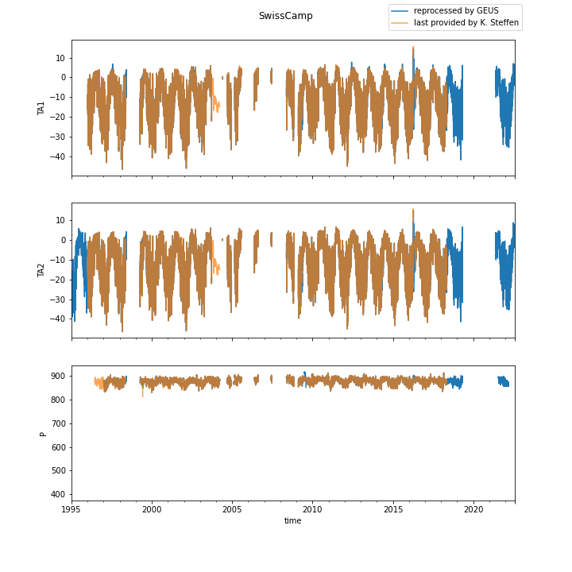
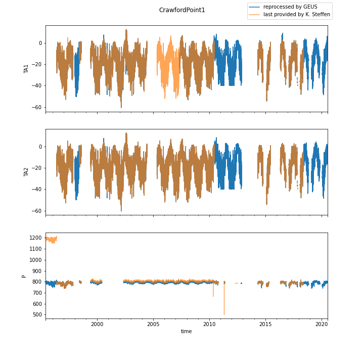
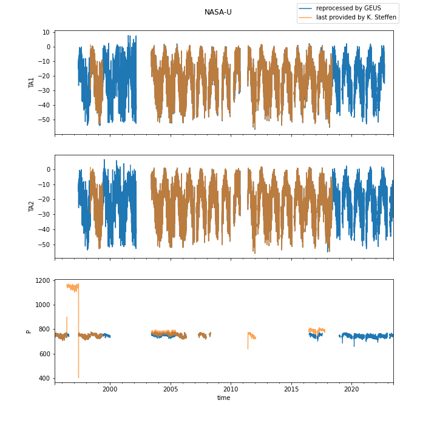
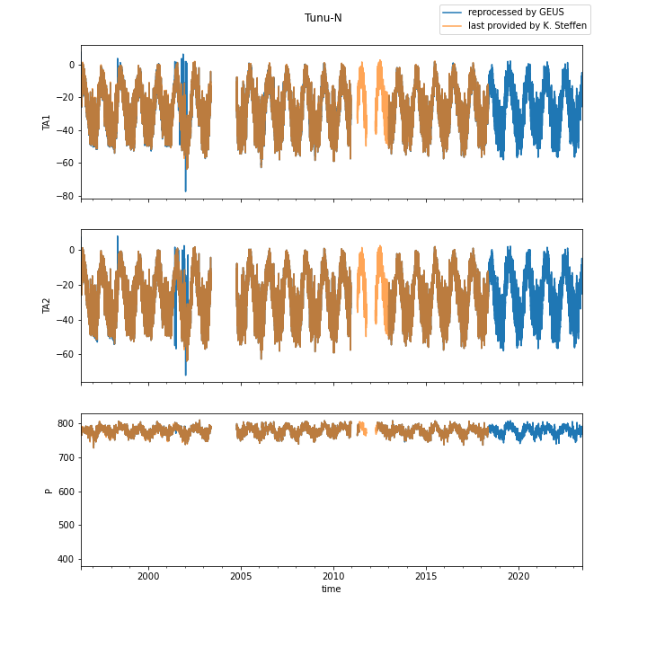
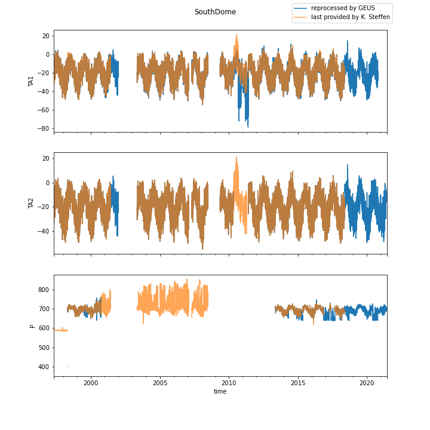
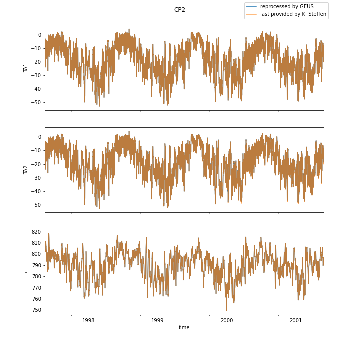

# 0 SwissCamp10m
no historical file to compare
# 1 SwissCamp

# 2 CrawfordPoint1

# 3 NASA-U

# 4 GITS

# 5 Humboldt
no historical file to compare
# 6 Summit

# 7 Tunu-N

# 8 DYE2

# 9 JAR1
no historical file to compare
# 10 Saddle

# 11 SouthDome

# 12 NASA-E

# 13 CP2

# 14 NGRIP
no historical file to compare
# 15 NASA-SE
no historical file to compare
# 16 KAR
no historical file to compare
# 17 JAR2
no historical file to compare
# 18 KULU
no historical file to compare
# 19 JAR3
no historical file to compare
# 20 Aurora
no historical file to compare
# 21 PetermannGlacier
no historical file to compare
# 22 PetermannELA
no historical file to compare
# 23 NEEM
no historical file to compare
# 24 E-GRIP
no historical file to compare
# 30 LAR1
no historical file to compare
# 31 LAR2
no historical file to compare
# 32 LAR3
no historical file to compare